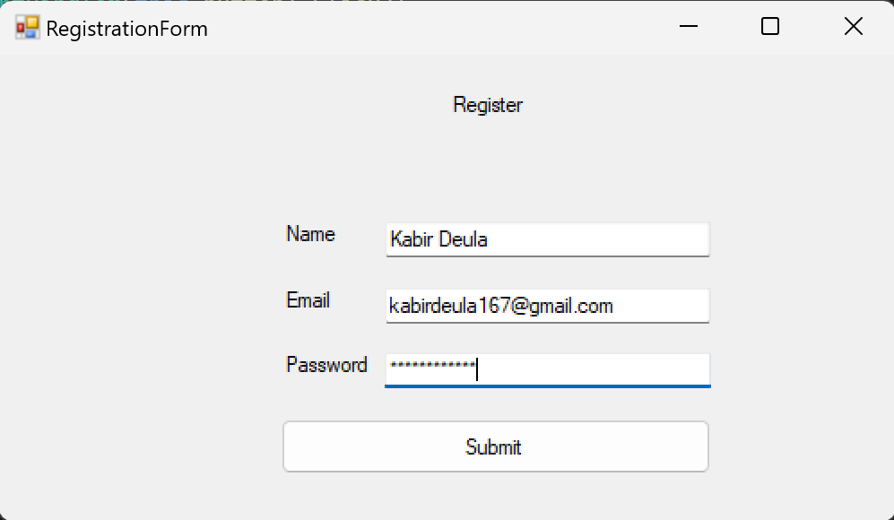

# Lab 03 - Registration Form

## Description
This C# program is a simple registration form implemented using Windows Forms. It allows users to input their name, email, and password. Basic validation is performed to ensure that the input fields are not left empty.

## Instructions
1. Run the program.
2. Input your name, email, and password into the respective fields.
3. If any field is left empty, a message box will prompt you to fill in the missing information.
4. Click the "Register" button to display the entered information in a message box.

## Usage
Simply run the program and interact with the registration form.

## Features
- Name Field: Enter your name.
- Email Field: Enter your email address.
- Password Field: Enter your desired password.
- Validation: The program ensures that none of the fields are left empty before registration.
- Display: Clicking the "Register" button displays the entered information in a message box.

## Source Code
```csharp
using System;
using System.Collections.Generic;
using System.ComponentModel;
using System.Data;
using System.Drawing;
using System.Linq;
using System.Text;
using System.Threading.Tasks;
using System.Windows.Forms;

namespace Lab03
{
    public partial class RegistrationForm : Form
    {
        public RegistrationForm()
        {
            InitializeComponent();
        }

        private void textBox1_Validating(object sender, CancelEventArgs e) {
            TextBox textBox = sender as TextBox;
            if (textBox.Name == "textBox1")
            {
                if(textBox.Text.Trim().Length == 0)
                {
                    MessageBox.Show("Cannot leave empty");
                    e.Cancel = true;
                    return;
                }
            }
        }

        private void textBox2_Validating(object sender, CancelEventArgs e)
        {
            TextBox textBox = sender as TextBox;
            if (textBox.Name == "textBox2")
            {
                if (textBox.Text.Trim().Length == 0)
                {
                    MessageBox.Show("Cannot leave empty");
                    e.Cancel = true;
                    return;
                }
            }
        }

        private void textBox3_Validating(object sender, CancelEventArgs e)
        {
            TextBox textBox = sender as TextBox;
            if (textBox.Name == "textBox3")
            {
                if (textBox.Text.Trim().Length == 0)
                {
                    MessageBox.Show("Cannot leave empty");
                    e.Cancel = true;
                    return;
                }
            }
        }

        private void button1_Click(object sender, EventArgs e)
        {
            MessageBox.Show("Name= " + textBox1.Text + "\nEmail: " + textBox2.Text + "\nPassword: " + textBox3.Text);
        }
    }
}
```

## Example


Fill in the required information and click "Register" to see the entered details displayed in a message box.