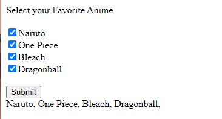

# Lab 06 - Cookies Demo

## Description
This ASP.NET web page demonstrates the use of cookies to store user preferences for favorite anime. Users can select their favorite anime from the provided checkboxes and submit their choices. The selected anime choices are then stored in cookies.

## Instructions
1. Open the web page in a web browser.
2. Select your favorite anime by checking the corresponding checkboxes.
3. Click the "Submit" button to store your choices.
4. Your selected anime choices will be stored in cookies.

## Usage
Simply open the web page and interact with the checkboxes to select your favorite anime.

## Features
- Checkbox Selection: Users can select their favorite anime from the provided checkboxes.
- Cookie Storage: Selected anime choices are stored in cookies for future reference.

## Source Code
```html
<%@ Page Language="C#" AutoEventWireup="true" CodeBehind="CookiesDemo.aspx.cs" Inherits="Lab06.CookiesDemo" %>

<!DOCTYPE html>

<html xmlns="http://www.w3.org/1999/xhtml">
<head runat="server">
    <title>Cookies Demo</title>
</head>
<body>
    <form id="form1" runat="server">
        <div>
            <asp:Label ID="Label1" runat="server" Text="Select your Favorite Anime"></asp:Label>
            <br /><br />
            <asp:CheckBox ID="naruto" runat="server" Text="Naruto" />
            <br />
            <asp:CheckBox ID="one_piece" runat="server" Text="One Piece" />
            <br />
            <asp:CheckBox ID="bleach" runat="server" Text="Bleach" />
            <br />
            <asp:CheckBox ID="dragonball" runat="server" Text="Dragonball" />
        </div>
        <br />
        <asp:Button ID="Button1" runat="server" OnClick="Button1_Click" Text="Submit" />
        <br />
        <asp:Label ID="Label2" runat="server"></asp:Label>
    </form>
</body>
</html>
```

## Example


Select your favorite anime by checking the checkboxes and click "Submit" to store your choices in cookies.