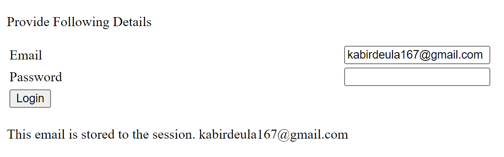

# Lab 07 - Session Demo

## Description
This ASP.NET web page demonstrates the usage of session variables to store user login information. Users can input their email and password, and upon clicking the "Login" button, their credentials will be stored in session variables.

## Instructions
1. Open the web page in a web browser.
2. Provide your email and password in the respective input fields.
3. Click the "Login" button to store your login information in session variables.
4. Your login information will be stored in session variables for future reference.

## Usage
Simply open the web page and input your email and password to store them in session variables.

## Features
- Email Input: Users can input their email address.
- Password Input: Users can input their password.
- Login Button: Clicking the "Login" button stores the entered email and password in session variables.
- Session Storage: User login information is stored in session variables.

## Source Code
```html
<%@ Page Language="C#" AutoEventWireup="true" CodeBehind="SessionDemo.aspx.cs" Inherits="Lab07.SessionDemo" %>

<!DOCTYPE html>

<html xmlns="http://www.w3.org/1999/xhtml">

<head runat="server">
    <title>Session Demo</title>
    <style type="text/css">
        .wh-50 {
            width: 50%;
        }

        .wh-55 {
            width: 55%;
        }
    </style>
</head>

<body>
    <form id="form1" runat="server">
        <div>
            <p>Provide Following Details</p>
            <table class="wh-50">
                <tr>
                    <td class="wh-55">Email</td>
                    <td>
                        <asp:TextBox ID="email" runat="server" TextMode="Email"></asp:TextBox>
                    </td>
                </tr>
                <tr>
                    <td class="wh-55">Password</td>
                    <td>
                        <asp:TextBox ID="password" runat="server" TextMode="Password"></asp:TextBox>
                    </td>
                </tr>
                <tr>
                    <td>
                        <asp:Button ID="login" runat="server" Text="Login" OnClick="login_Click" />
                    </td>
                </tr>
            </table>
        </div>
        <br />
        <asp:Label ID="Label1" runat="server"></asp:Label>
        <asp:Label ID="Label2" runat="server"></asp:Label>
    </form>
</body>

</html>
```

## Example


Provide your email and password, then click "Login" to store your login information in session variables.