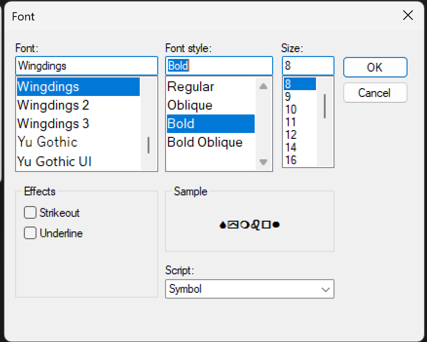
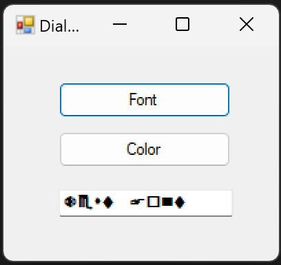

# Lab 08 - Dialog Box Demo

## Description
This C# program demonstrates the usage of dialog boxes in a Windows Forms application. It includes functionality to change the font and background color of a text box and form, respectively, using the Font Dialog and Color Dialog.

## Instructions
1. Run the program.
2. Click on the "Choose Font" button to open the Font Dialog.
3. Select a font style, size, and color from the Font Dialog, then click "OK" to apply the changes to the text box.
4. Click on the "Choose Color" button to open the Color Dialog.
5. Select a color from the Color Dialog, then click "OK" to apply the changes to the form's background color.

## Usage
Simply run the program and interact with the provided buttons to change the font and background color.

## Features
- Font Selection: Click the "Choose Font" button to open the Font Dialog and select a font for the text box.
- Font Preview: The selected font is previewed in the text box.
- Color Selection: Click the "Choose Color" button to open the Color Dialog and select a color for the form's background.
- Color Preview: The selected color is previewed as the background color of the form.

## Source Code
```csharp
using System;
using System.Collections.Generic;
using System.ComponentModel;
using System.Data;
using System.Drawing;
using System.Linq;
using System.Text;
using System.Threading.Tasks;
using System.Windows.Forms;

namespace Lab08
{
    public partial class DialogBoxDemo : Form
    {
        public DialogBoxDemo()
        {
            InitializeComponent();
        }

        private void button1_Click(object sender, EventArgs e)
        {
            fontDialog.ShowDialog();
            textBox1.Font = fontDialog.Font;
        }

        private void button2_Click(object sender, EventArgs e)
        {
            colorDialog.ShowDialog();
            this.BackColor = colorDialog.Color;
        }
    }
}
```

## Example




Click on "Choose Font" to select a font for the text box and "Choose Color" to select a background color for the form.