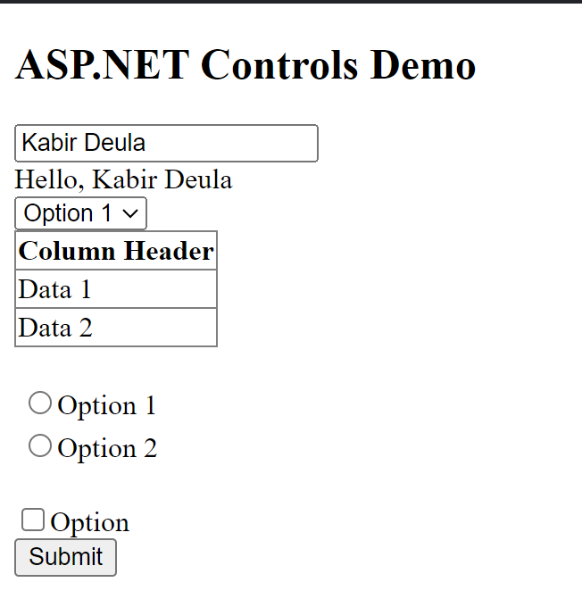

# Lab 10 - ASP.NET Controls Demo

## Description
This ASP.NET web page demonstrates the usage of various ASP.NET server controls. It includes examples of TextBox, Label, DropDownList, GridView, RadioButtonList, CheckBox, and Button controls.

## Instructions
1. Open the web page in a web browser.
2. Interact with the provided controls as needed:
   - Enter your name in the TextBox.
   - Select an option from the DropDownList.
   - Check or uncheck the CheckBox.
   - Click the "Submit" button to trigger the event handler.
3. The event handler will update the Label with a message based on the selected options.

## Usage
Simply open the web page and interact with the ASP.NET controls.

## Features
- TextBox: Allows users to input text, such as their name.
- Label: Displays messages or information to the user.
- DropDownList: Provides a dropdown list of options for selection.
- GridView: Displays tabular data in a grid format.
- RadioButtonList: Presents a list of options as radio buttons for single selection.
- CheckBox: Allows users to select or deselect options.
- Button: Triggers an event handler when clicked to perform actions or submit data.

## Source Code
```html
<%@ Page Language="C#" AutoEventWireup="true" CodeBehind="ASPControlsDemo.aspx.cs" Inherits="Lab10.ASPControlsDemo" %>

<!DOCTYPE html>

<html xmlns="http://www.w3.org/1999/xhtml">
<head runat="server">
    <title></title>
</head>
<body>
    <form id="form1" runat="server">
        <div>
            <h2>ASP.NET Controls Demo</h2>
             <asp:TextBox ID="txtName" runat="server" placeholder="Enter your name"></asp:TextBox><br />
            
            
            <asp:Label ID="lblMessage" runat="server" Text=""></asp:Label><br />
            
            <asp:DropDownList ID="ddlOptions" runat="server">
                <asp:ListItem Text="Option 1" Value="1"></asp:ListItem>
                <asp:ListItem Text="Option 2" Value="2"></asp:ListItem>
            </asp:DropDownList><br />
            
            <asp:GridView ID="gvData" runat="server" AutoGenerateColumns="False">
                <Columns>
                    <asp:BoundField DataField="ColumnName" HeaderText="Column Header" />
                </Columns>
            </asp:GridView><br />
            <asp:RadioButtonList ID="rblOptions" runat="server">
                <asp:ListItem Text="Option 1" Value="1"></asp:ListItem>
                <asp:ListItem Text="Option 2" Value="2"></asp:ListItem>
            </asp:RadioButtonList><br />
            
            <asp:CheckBox ID="chkOption" runat="server" Text="Option"></asp:CheckBox><br />
            <asp:Button ID="btnSubmit" runat="server" Text="Submit" OnClick="btnSubmit_Click" /><br />
        </div>
    </form>
</body>
</html>
```

## Example


Interact with the provided controls and click "Submit" to see the updated message in the Label.