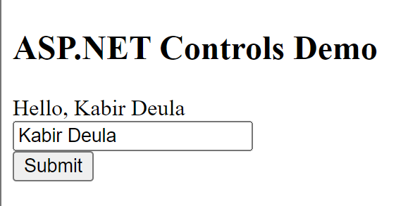

# Lab 11 - ASP.NET Controls Demo

## Description
This ASP.NET web page demonstrates various ASP.NET controls for user input and interaction. It includes examples of labels, text boxes, buttons, and a grid view for displaying data.

## Instructions
1. Open the web page in a web browser.
2. Enter your name into the text box.
3. Click the "Submit" button.
4. The submitted data will be processed and displayed accordingly.

## Usage
Simply open the web page and interact with the provided controls.

## Features
- Label: Displays messages or instructions to the user.
- Text Box: Allows users to input text or data.
- Button: Triggers an action or event when clicked.
- Grid View: Displays tabular data in a grid format.
- Radio Button List: Presents a list of options from which users can select one.
- Check Box: Allows users to select one or more options from a list.
- DropDown List: Provides a dropdown menu for selecting an option from a list.

## Source Code
```html
<%@ Page Language="C#" AutoEventWireup="true" CodeBehind="ASPDemo.aspx.cs" Inherits="Lab11.ASPDemo" %>

<!DOCTYPE html>

<html xmlns="http://www.w3.org/1999/xhtml">
<head runat="server">
    <title>ASP.NET Controls Demo</title>
</head>
<body>
    <form id="form1" runat="server">
        <div>
            <h2>ASP.NET Controls Demo</h2>
            
            <asp:Label ID="lblMessage" runat="server" Text=""></asp:Label><br />
            
            <asp:TextBox ID="txtInput" runat="server" placeholder="Enter your name"></asp:TextBox><br />
            
            <asp:Button ID="btnSubmit" runat="server" Text="Submit" OnClick="btnSubmit_Click" />
      
        </div>
    </form>
</body>
</html>
```

## Example


Enter your name into the text box and click "Submit" to process the input.