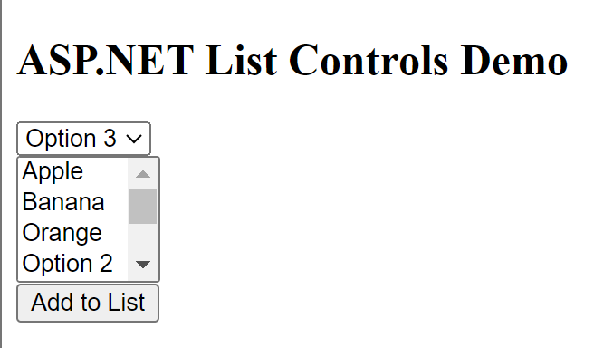

# ASP.NET List Controls Demo

## Description
This ASP.NET web page demonstrates the usage of list controls, specifically the DropDownList and ListBox controls. Users can select options from the DropDownList, and upon selection, the chosen option is displayed in the ListBox. Users can also add selected options to the ListBox.

## Instructions
1. Open the web page in a web browser.
2. Select an option from the DropDownList.
3. The selected option will be displayed in the ListBox.
4. To add the selected option to the ListBox, click the "Add to List" button.

## Usage
Simply open the web page and interact with the provided controls.

## Features
- DropDownList: Presents a dropdown menu for selecting an option from a list.
- ListBox: Displays a list of items, and users can select one or more items from the list.
- Selection Mode: The ListBox supports multiple selection mode, allowing users to select multiple items.
- Add to List: Clicking the "Add to List" button adds the selected option from the DropDownList to the ListBox.

## Source Code
```html
<%@ Page Language="C#" AutoEventWireup="true" CodeBehind="ASPDropDownDemo.aspx.cs" Inherits="Lab12.ASPDropDownDemo" %>

<!DOCTYPE html>

<html xmlns="http://www.w3.org/1999/xhtml">
<head runat="server">
    <title>ASP.NET List Controls Demo</title>
</head>
<body>
    <form id="form1" runat="server">
        <div>
             <h2>ASP.NET List Controls Demo</h2>
            
            <asp:DropDownList ID="ddlOptions" runat="server" AutoPostBack="True" OnSelectedIndexChanged="ddlOptions_SelectedIndexChanged">
                <asp:ListItem Text="Option 1" Value="1"></asp:ListItem>
                <asp:ListItem Text="Option 2" Value="2"></asp:ListItem>
                <asp:ListItem Text="Option 3" Value="3"></asp:ListItem>
            </asp:DropDownList><br />
            
            <asp:ListBox ID="lbSelections" runat="server" SelectionMode="Multiple" Rows="4"></asp:ListBox><br />
            
            <asp:Button ID="btnAdd" runat="server" Text="Add to List" OnClick="btnAdd_Click" />
       
        </div>
    </form>
</body>
</html>
```

## Example


Select an option from the DropDownList, and it will be displayed in the ListBox. To add the selected option to the ListBox, click "Add to List".