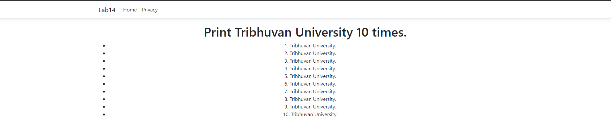

# Lab 14 - ASP.NET Razor Page Example

## Description
This ASP.NET Razor Page generates a list containing the text "Tribhuvan University" ten times using a loop. It demonstrates the usage of Razor syntax to create dynamic content.

## Instructions
1. Open the Razor Page in a web browser.
2. The page will display a list containing "Tribhuvan University" repeated ten times.

## Usage
Simply open the Razor Page in a web browser to view the generated list.

## Features
- Dynamic Content: Utilizes a loop to generate the list dynamically.
- Razor Syntax: Employs Razor syntax to embed C# code within HTML markup.

## Razor Page Code
```html
@page
@model IndexModel
@{
    ViewData["Title"] = "Home page";
}

<div class="text-center">
    <h1>Print Tribhuvan University 10 times.</h1>

    <ul>
        @for(int i = 0; i<10; i++)
        {
        <li>@($"{i+1}. Tribhuvan University.")</li>
            
        }
    </ul>
</div>
```

## Example


The page displays a list containing "Tribhuvan University" repeated ten times, numbered from 1 to 10.